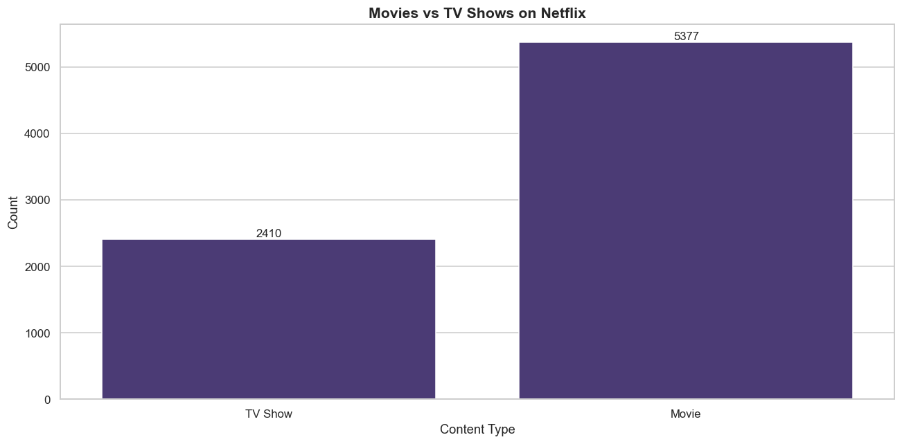
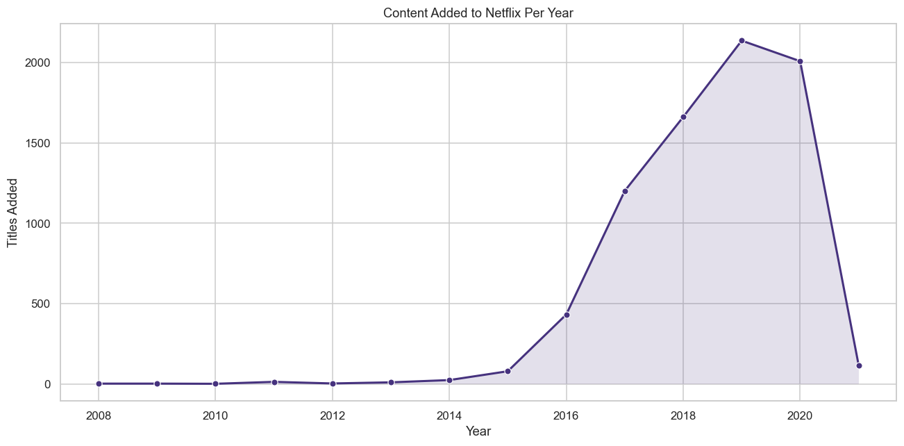
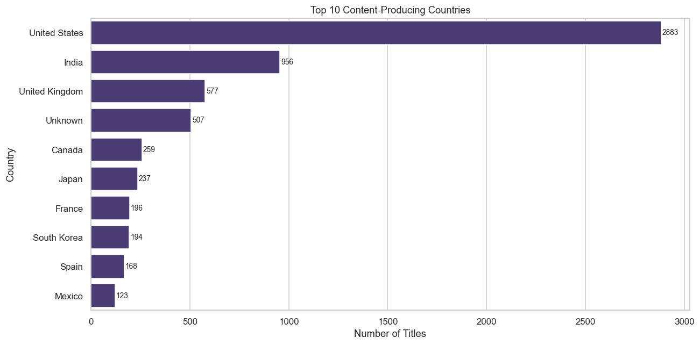
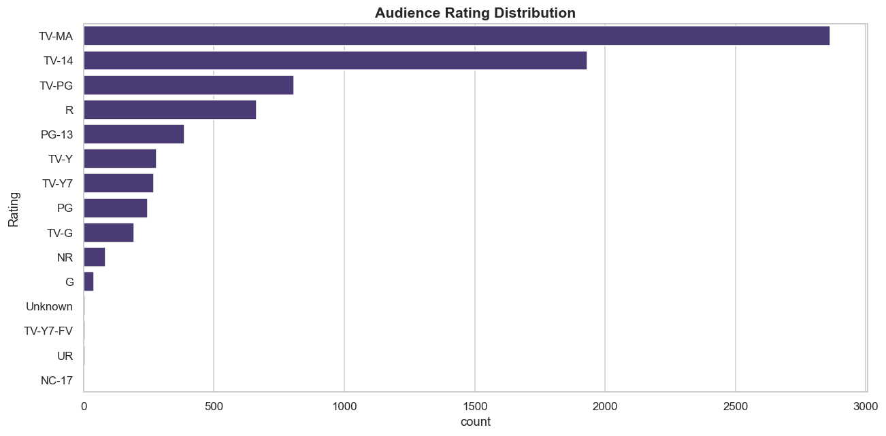
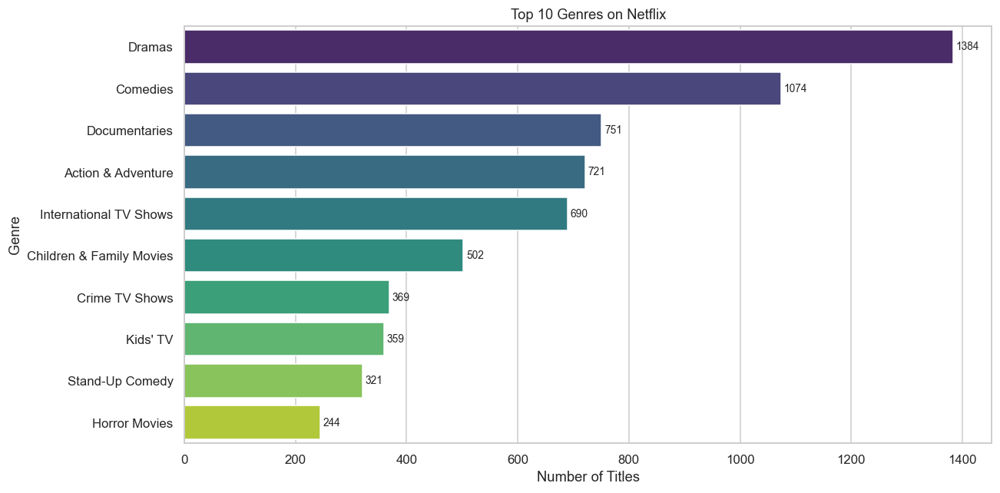
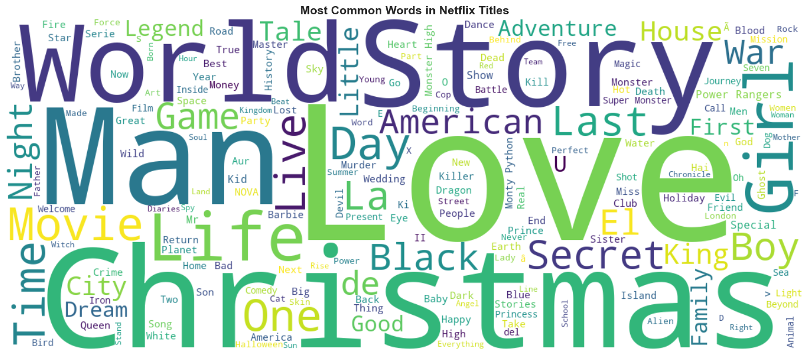

<div align="center">


# Netflix Content Analysis

**An exploratory data analysis of Netflix's content library with interactive visualisations and a content-based recommendation engine.**

[](https://python.org)
[](https://jupyter.org)
[](https://pandas.pydata.org)
[](https://plotly.com)
[](https://streamlit.io)
[](LICENSE)

[📓 Notebook](Netflix_Data_Analysis.ipynb) &nbsp;·&nbsp; [🚀 Live Dashboard](https://netflixdataexploration-vcxow72tjec5xfynsxkedl.streamlit.app) &nbsp;·&nbsp; [📊 Dataset](https://www.kaggle.com/datasets/shivamb/netflix-shows)

</div>

---

## Overview

This project analyses Netflix's global content catalogue to uncover patterns in content type, country distribution, genre trends, audience ratings, and release behaviour. The analysis is built as a reproducible Jupyter Notebook and is paired with an interactive Streamlit dashboard.

A lightweight **content-based recommendation engine** is included — built with TF-IDF and cosine similarity, it suggests titles similar to any given Netflix show or movie.

---

## Features

**Data Pipeline**
- Automatic Excel / CSV file detection and loading
- Column name normalisation, NaN handling, and date parsing
- Primary genre and country extraction from comma-separated fields
- Duplicate removal and cleaned dataset export to `outputs/`

**Visualisations**
- Movies vs TV Shows — annotated count bar chart
- Content added per year — line chart with area fill
- Top 10 content-producing countries — horizontal bar chart
- Audience rating distribution
- Content type breakdown by country — stacked bar chart
- Movie duration distribution — histogram with KDE overlay
- Top 10 genres — exploded from multi-value genre lists
- Global content distribution — interactive Plotly choropleth map
- Monthly content addition heatmap — interactive Plotly chart
- Title word cloud

**Recommendation Engine**
- TF-IDF vectorisation over title description, genre, and cast
- Cosine similarity computed across the full catalogue
- `recommend(title, n)` — returns the top-n most similar titles

**Streamlit Dashboard (`app.py`)**
- Sidebar filters: content type and year range
- Live KPI cards: total titles, movies, TV shows, countries, top rating
- All charts update dynamically with filters
- Embedded recommendation UI

---

## Dataset

| Field | Details |
|---|---|
| Source | [Netflix Shows — Kaggle](https://www.kaggle.com/datasets/shivamb/netflix-shows) |
| File | `Netflix_Dataset.xlsx` |
| Rows | ~8,800 titles |
| Columns | 12 (Show ID, Type, Title, Director, Cast, Country, Date Added, Release Year, Rating, Duration, Listed In, Description) |

> The raw dataset is excluded from this repository via `.gitignore`.  
> Download it from the Kaggle link above and place it at `data/Netflix_Dataset.xlsx` before running the notebook.

---

## Project Structure

```
netflix-data-analysis/
│
├── Netflix_Data_Analysis.ipynb    # Main analysis notebook
├── app.py                         # Streamlit interactive dashboard
├── requirements.txt               # Python dependencies
├── .gitignore                     # Git ignore rules
├── LICENSE                        # MIT licence
│
├── data/
│   └── .gitkeep                   # Keeps folder tracked — place dataset here
│
└── outputs/                       # Auto-generated on notebook run
    ├── 01_movies_vs_tvshows.png
    ├── 02_yearly_trend.png
    ├── 03_top_countries.png
    ├── 04_ratings.png
    ├── 05_country_category_stacked.png
    ├── 06_movie_duration.png
    ├── 07_top_genres.png
    ├── 08_country_map.html
    ├── 09_monthly_heatmap.html
    ├── 10_wordcloud.png
    ├── netflix_cleaned.csv
    └── insights.csv
```

---

## Tech Stack

| Library | Version | Purpose |
|---|---|---|
| `pandas` | 2.0+ | Data loading, cleaning, and aggregation |
| `numpy` | 1.24+ | Numerical operations |
| `openpyxl` | 3.1+ | Reading `.xlsx` files |
| `matplotlib` | 3.7+ | Base charting engine |
| `seaborn` | 0.12+ | Statistical chart styling |
| `plotly` | 5.15+ | Interactive HTML charts and maps |
| `wordcloud` | 1.9+ | Title word cloud |
| `scikit-learn` | 1.3+ | TF-IDF vectorisation and cosine similarity |
| `streamlit` | 1.25+ | Interactive web dashboard |

---

## Installation

**Requirements:** Python 3.9 or higher · pip · Git

```bash
# 1. Clone the repository
git clone https://github.com/ParvathyM155/netflix-data-analysis.git
cd netflix-data-analysis

# 2. Create and activate a virtual environment
python -m venv venv
source venv/bin/activate        # macOS / Linux
venv\Scripts\activate           # Windows

# 3. Install all dependencies
pip install -r requirements.txt

# 4. Add the dataset
# Download Netflix_Dataset.xlsx from Kaggle and place it at:
#   data/Netflix_Dataset.xlsx
```

---

## Usage

### Run the notebook

```bash
jupyter notebook Netflix_Data_Analysis.ipynb
```

Inside Jupyter, select **Kernel → Restart & Run All**. All 10 charts and both CSV exports will be saved to `outputs/` automatically.

### Run the Streamlit dashboard

```bash
streamlit run app.py
```

Opens at `http://localhost:8501`. Use the sidebar to filter by content type and year range. The recommendation engine is at the bottom of the page.

---

## Screenshots

| Movies vs TV Shows | Yearly Content Trend |
|:---:|:---:|
|  |  |

| Top 10 Countries | Rating Distribution |
|:---:|:---:|
|  |  |

| Top 10 Genres | Title Word Cloud |
|:---:|:---:|
|  |  |

---

## Key Insights

| Finding | Detail |
|---|---|
| Content split | Movies account for ~70% of the catalogue; TV Shows ~30% |
| Growth peak | The most content was added between 2018 and 2020 |
| Top country | The United States is the largest single content producer |
| Common rating | TV-MA is the most frequent audience rating |
| Top genre | International Movies and Dramas lead all genre categories |
| Movie length | Most movies fall between 90 and 120 minutes |
| Seasonal pattern | October and December have the highest monthly content additions |

---

## Recommendation Engine

The engine uses **content-based filtering**:

1. A composite **Tags** field is built per title from its description, genre list, and cast
2. Tags are vectorised with **TF-IDF** — 5,000-term vocabulary, English stop-words removed
3. A **cosine similarity matrix** is computed across all titles
4. Given a query title, the top-n closest matches by similarity score are returned

```python
# Example — inside the notebook
recommend("Stranger Things", n=5)

#    Title           Category   Main_Genre
# 0  Dark            TV Show    International TV Shows
# 1  The OA          TV Show    TV Dramas
# 2  Glitch          TV Show    International TV Shows
# 3  The Rain        TV Show    International TV Shows
# 4  Travelers       TV Show    TV Sci-Fi & Fantasy
```

---

## Future Enhancements

- Replace TF-IDF with sentence-transformer embeddings for semantic similarity
- Add VADER / TextBlob sentiment analysis on title descriptions
- Connect the cleaned CSV to a Power BI or Tableau dashboard
- Forecast content addition trends with Facebook Prophet
- Wrap the recommender in a FastAPI REST endpoint

---

## License

This project is licensed under the **MIT License** — see [LICENSE](LICENSE) for details.

---

## Author

**[Parvathy]**  

[](https://github.com/ParvathyM155)
[](https://linkedin.com/in/parvathym155)
[](mailto:parvathym133@gmail.com)

---

<div align="center">
If this project was helpful, consider giving it a ⭐
</div>
